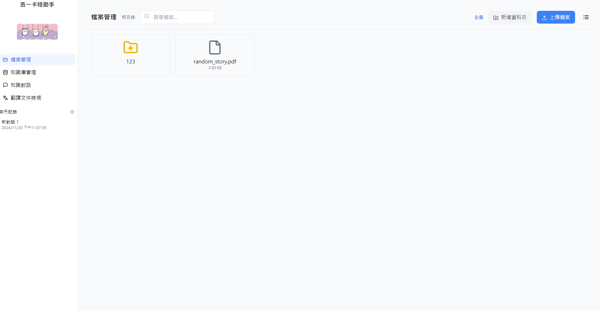
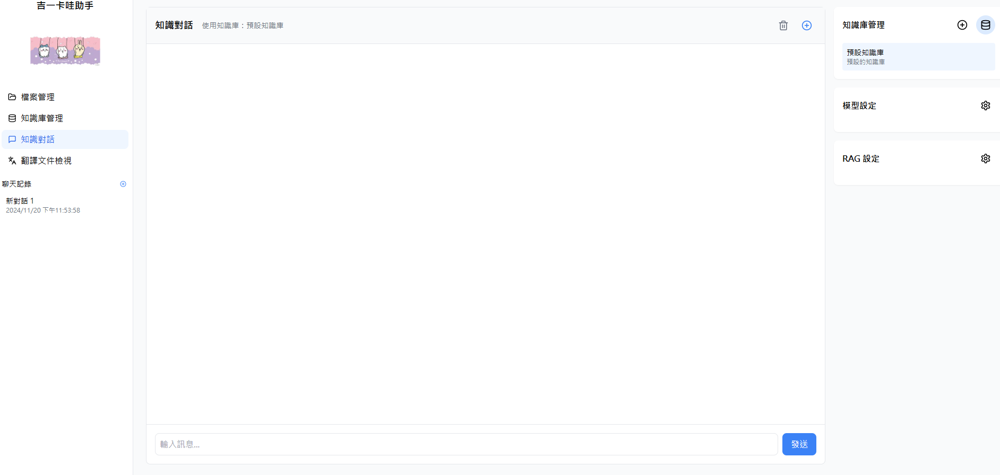
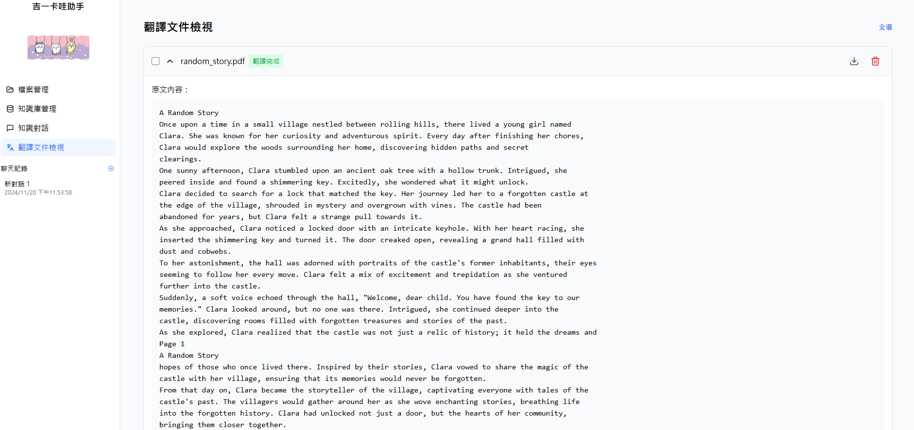

<div align="center">
  

  <h1>Translation Chat Project</h1>
  <p>基於 RAG 的多語文件翻譯與知識庫對話助手。</p>
</div>

`Translation Chat Project` 是一個以 **React + TypeScript** 前端與 **FastAPI** 後端打造的翻譯助手，支援文件上傳、知識庫檢索對話，以及多語翻譯流程。此專案適合用於內部知識整理、翻譯輔助與文件工作流自動化。

## ✨ 功能特色

- 上傳並管理 PDF、TXT、DOCX 等文件
- 使用 ChromaDB 建立知識庫並進行檢索增強對話（RAG）
- 提供翻譯流程與結果下載能力
- 支援前後端分離部署與 Docker 啟動

## 🖼️ 介面預覽

### 檔案管理
<div align="center">
  
</div>

### 知識庫對話
<div align="center">
  
</div>

### 翻譯功能
<div align="center">
  
</div>

## 🏗️ 技術架構

### Frontend
- React
- TypeScript
- Tailwind CSS
- Lucide React

### Backend
- FastAPI
- ChromaDB
- LangChain
- Python-docx / PDF parsing utilities

## 📁 專案結構

```text
Translation-chat-project/
├── frontend/              # React + TypeScript UI
├── backend/               # FastAPI API 與 RAG / 翻譯邏輯
├── docker-compose.yml     # 本機整合啟動設定
├── nginx.conf             # 前端反向代理設定
└── README.md
```

## 🚀 快速開始

### 需求

- Node.js 18+
- Python 3.9+
- Docker / Docker Compose（可選）

### 1. 下載原始碼

```bash
git clone https://github.com/Chunweiwu518/Translation-chat-project.git
cd Translation-chat-project
```

### 2. 設定前端環境變數

```bash
copy frontend/.env.example frontend/.env
```

將 `REACT_APP_API_URL` 指向你的後端服務，例如本機 `http://localhost:8000`。

### 3. 安裝前端依賴

```bash
cd frontend
npm install
npm start
```

### 4. 設定後端環境變數

```bash
cd ..
copy backend/.env.example backend/.env
```

### 5. 安裝後端依賴

```bash
cd backend
python -m venv .venv
.venv\Scripts\activate
pip install -r requirements.txt
uvicorn app:app --reload --host 0.0.0.0 --port 8000
```

## 🔧 環境變數

### Frontend (`frontend/.env`)

- `REACT_APP_API_URL`: 前端呼叫的後端 API 位址

### Backend (`backend/.env`)

- `MODEL_NAME`: 使用的模型名稱
- `SOURCE_LANG`: 預設來源語言
- `TARGET_LANG`: 預設目標語言
- `COUNTRY`: 語系 / 地區設定
- `API_KEY`: 模型或翻譯服務 API 金鑰
- `API_URL`: 模型服務 API 位址
- `API_HOST`: 模型服務 Host
- `CHROMA_PATH`: 向量資料庫儲存位置

## 🐳 Docker 啟動

如果你希望使用容器啟動整個系統：

```bash
docker compose up --build
```

## 🤝 貢獻方式

歡迎透過 Issue 或 Pull Request 參與改進。建議貢獻流程：

1. Fork 此專案
2. 建立功能分支
3. 提交清楚的 commit message
4. 附上測試或驗證方式

## 📄 License

本專案採用 [MIT License](./LICENSE)。
